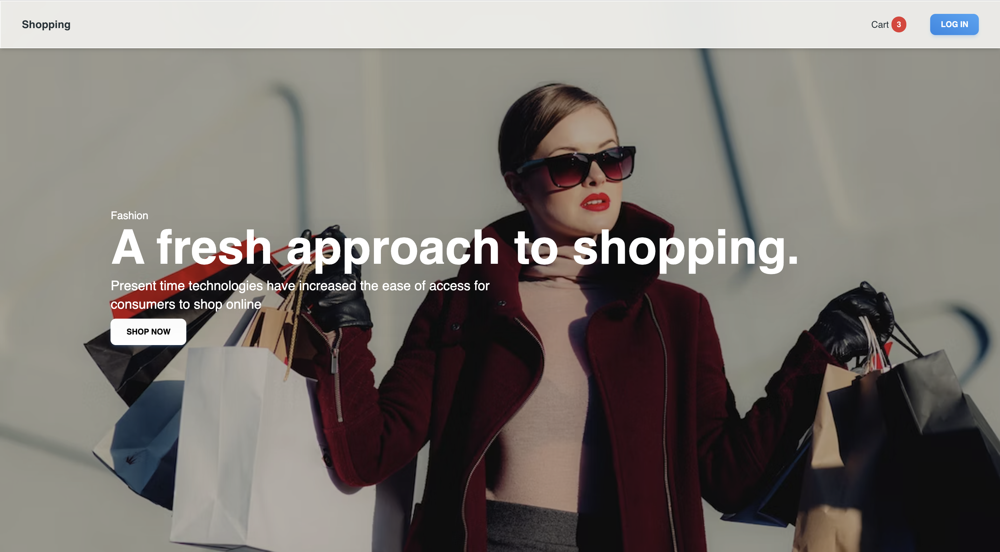

# Shopping | E-commerce Web App
In this project, we will build a full-stack e-commerce web application using the Next.js framework, TailwindCSS for styling, and Supabase as the backend. The application will have the following features:
* Product catalog 
* Shopping cart and checkout 

This is a [Next.js](https://nextjs.org/) project bootstrapped with [`create-next-app`](https://github.com/vercel/next.js/tree/canary/packages/create-next-app).

## Demo
* _Check out the live demo of my e-commerce web application:_ [https://shopping-ebon.vercel.app/](https://shopping-ebon.vercel.app/).
### You need to login to use the App with verificated account :
* Username: user@gmail.com
* Password: 123456
#### Log in UI


### Screenshot

### Product Page

### Cart Section


## Overall
This ecommerce website is developed using the following technologies:

* [![React][React.js]][React-url] is the highly used open-source JavaScript Library.
* [![Next][Next.js]][Next-url] A popular React framework for building server-rendered and static websites.
*  A utility-first CSS framework for rapidly building responsive and customizable user interfaces.
*  An open-source alternative to Firebase that provides a powerful and scalable backend platform.
The website allows users to browse and purchase products, manage their shopping cart, and complete orders. It utilizes Supabase for data storage, authentication, and real-time updates.

## Features
- User authentication: Users can create accounts, log in, and manage their profiles.
- Product listing: Users can browse available products with detailed information and add them to the shopping cart.
- Shopping cart: Users can manage their shopping cart by adding, removing, and updating products.
- Checkout process: Users can proceed to the checkout, enter shipping and payment information, and complete their orders.

## Prerequisites
Before running the ecommerce website, ensure you have the following prerequisites installed on your system:

- Node.js (v12.0.0 or higher)
- npm or yarn package manager
- Supabase account and project

&nbsp;

## Getting Started
Follow the steps below to set up and run the ecommerce website locally:

### Clone the repository:

```bash
git clone https://github.com/nguyentheloc-310101/shopping.git
cd shopping
```

### Install dependencies:
```bash
npm install
```

### Set up environment variables:
Create a .env.local file in the project root directory and add the following variables:
```bash
NEXT_PUBLIC_SUPABASE_URL=<your-supabase-url>
NEXT_PUBLIC_SUPABASE_PUBLIC_KEY=<your-supabase-public-key>
```

Replace \<your-supabase-url\> and \<your-supabase-public-key\> with your Supabase project details.

### Run the application:
```bash
npm run dev
```
This command will start the development server. Open your browser and access http://localhost:3000 to view the ecommerce website.

### Deployment
To deploy the ecommerce website to a production environment, you can follow the deployment guides provided by Next.js and Supabase. Here are some general steps:

Build the production-ready code:

```bash
npm run build
```
Deploy the built files to your preferred hosting provider.

Set up environment variables in your hosting environment similar to the .env.local file used for local development.

Start the server or hosting service to run the application.

Open [http://localhost:3000](http://localhost:3000) with your browser to see the result.

You can start editing the page by modifying `pages/index.js`. The page auto-updates as you edit the file.

[API routes](https://nextjs.org/docs/api-routes/introduction) can be accessed on [http://localhost:3000/api/hello](http://localhost:3000/api/hello). This endpoint can be edited in `pages/api/hello.js`.

The `pages/api` directory is mapped to `/api/*`. Files in this directory are treated as [API routes](https://nextjs.org/docs/api-routes/introduction) instead of React pages.

This project uses [`next/font`](https://nextjs.org/docs/basic-features/font-optimization) to automatically optimize and load Inter, a custom Google Font.

## Acknowledgments
This ecommerce website is built using the following open-source projects:

- Next.js: https://nextjs.org/
- Tailwind CSS: https://tailwindcss.com/
- Supabase: https://supabase.io/
We extend our gratitude to the contributors and maintainers of these projects for their fantastic work.


## Learn More

To learn more about Next.js, take a look at the following resources:

- [Next.js Documentation](https://nextjs.org/docs) - learn about Next.js features and API.
- [Learn Next.js](https://nextjs.org/learn) - an interactive Next.js tutorial.

You can check out [the Next.js GitHub repository](https://github.com/vercel/next.js/) - your feedback and contributions are welcome!

## Deploy on Vercel

The easiest way to deploy your Next.js app is to use the [Vercel Platform](https://vercel.com/new?utm_medium=default-template&filter=next.js&utm_source=create-next-app&utm_campaign=create-next-app-readme) from the creators of Next.js.

Check out our [Next.js deployment documentation](https://nextjs.org/docs/deployment) for more details.
## Feedback

If you have any feedback, please contact me at nguyentheloc310101@gmail.com

[Next.js]: https://img.shields.io/badge/next.js-000000?style=for-the-badge&logo=nextdotjs&logoColor=white
[Next-url]: https://nextjs.org/
[React.js]: https://img.shields.io/badge/React-20232A?style=for-the-badge&logo=react&logoColor=61DAFB
[React-url]: https://reactjs.org/
